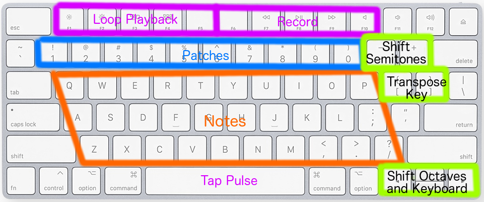

This is a GUI for [rust-synth](https://github.com/vitobasso/rust-synth), 
it lets you play the synth with your keyboard and serves as an example of how to use the library.

https://user-images.githubusercontent.com/1895014/156939415-c54ace62-1e4c-4799-9b85-662b53e8bbd1.mp4


# Running

## To play with your computer keyboard
```
cargo run --release
```
The GUI is just a black window for now :)   
But you get to play sound with your keyboard.

### Keymap


Moving the mouse over the window modulates the filter.

## To play a MIDI file
```
cargo run --release <path to midi file>
```


# Compatibility

Known to work on MacOS 10.14 at least :)

Compatibility will depend on the graphics and audio driver libs used:
[piston_window](https://docs.piston.rs/piston_window/piston_window/)
and [cpal](https://github.com/RustAudio/cpal) respectively.
